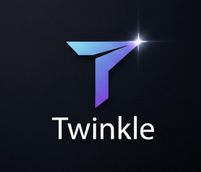
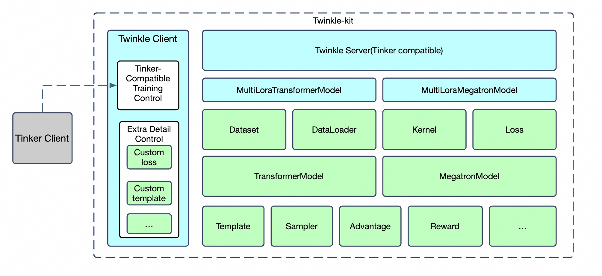
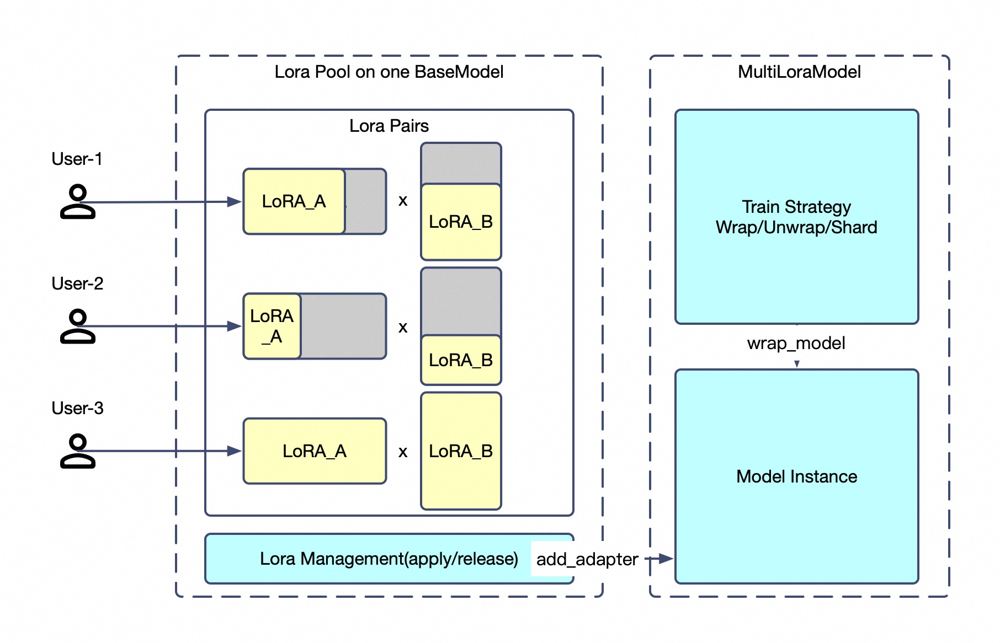

# Twinkle: Training workbench to make your model glow

<p align="center">
    
<p>
<p align="center">
<a href="https://modelscope.cn/home">ModelScope</a>
<br>
        <a href="README.md">English</a>&nbsp ｜ &nbsp中文&nbsp
</p>

<p align="center">


<a href="https://pypi.org/project/twinkle/"></a>
<a href="https://github.com/modelscope/twinkle/blob/main/LICENSE"></a>
<a href="https://pepy.tech/project/twinkle-kit"></a>
<a href="https://github.com/modelscope/twinkle/pulls"></a>
</p>

<p align="center">
        <a href="https://twinkle-kit.readthedocs.io/en/latest/">英文文档</a> &nbsp ｜ &nbsp <a href="https://twinkle-kit.readthedocs.io/zh-cn/latest/">中文文档</a> &nbsp
</p>

## ✨ Twinkle 是什么？

Twinkle✨ 是一个轻量级的客户端-服务端训练框架，采用模块化、高内聚的接口设计。无论你是使用 `torchrun` 在本地执行，还是跨 Ray 集群扩展训练，Twinkle✨ 通过将训练逻辑封装成标准化 API 来消除基础设施层面的摩擦。除了简单的抽象之外，Twinkle✨ 还作为强大的后端和网关，实现无服务器训练即服务（TaaS）。它提供的接口是 [Tinker](https://thinkingmachines.ai/tinker/) API 的_超集_，因此可以通过 Tinker 客户端或原生 Twinkle✨ 客户端（提供更多功能）来访问 Twinkle✨ 训练服务。

🧩 <b>解耦架构</b>：标准化接口，向后兼容 Tinker API。<br>
🚀 <b>多种运行模式</b>：torchrun / Ray / HTTP。<br>
🔌 <b>多样化后端</b>：Transformers / Megatron。<br>
👥 <b>多租户训练服务</b>：在共享一个基础模型部署的情况下训练多个 LoRA。<br>

注意：Twinkle✨ 由 [ms-swift](https://github.com/modelscope/ms-swift) 背后的团队构建，我们期望这两个项目能够共同发展。我们预计 Twinkle✨ 中的一些基础组件将可能被 [ms-swift](https://github.com/modelscope/ms-swift) 复用。

|                    魔搭社区twinkle算法交流群                    |
|:------------------------------------------------------:|
|  |

## 安装

### 使用包安装：

```shell
pip install 'twinkle-kit'
```

### 从源码安装：

```shell
git clone https://github.com/modelscope/twinkle.git
cd twinkle
pip install -e .
```

## 教程

| 训练类型                     | 模型框架 | Cookbook 路径                                     |
| ---------------------------- | -------- | ------------------------------------------------- |
| FSDP 微调                    | transformers    | [脚本](cookbook/transformers/fsdp2.py)             |
| FSDP MoE 微调                | transformers    | [脚本](cookbook/transformers/fsdp2_moe.py)         |
| EP MoE 微调                  | transformers    | [脚本](cookbook/transformers/ep_fsdp_qwen3_moe.py) |
| pp/tp/cp 微调                | megatron        | [脚本](cookbook/megatron/tp.py)                    |
| pp/tp/cp MoE 微调            | megatron        | [脚本](cookbook/megatron/tp_moe.py)                |
| tinker 客户端微调            | megatron        | [脚本](cookbook/client/tinker/megatron)            |
| tinker 客户端微调/采样       | transformers    | [脚本](cookbook/client/tinker/transformer)         |
| twinkle 客户端微调           | megatron        | [脚本](cookbook/client/twinkle/megatron)           |
| twinkle 客户端微调           | transformer     | [脚本](cookbook/client/twinkle/transformer)        |

## 更新日志

- 🎉2026-02-13 Twinkle✨ 初始版本发布，包括对文本模型的 SFT/PT/RL 支持以及在 [ModelScope](https://modelscope.cn) 上的无服务器训练能力。

## ModelScope 的训练服务

我们正在 ModelScope 上推出基于 Twinkle✨ 构建的训练服务。目前处于 _Beta_ 阶段。你可以通过加入 [Twinkle-Explorers](https://modelscope.cn/organization/twinkle-explorers) 组织来注册免费访问，并通过 API 端点 `base_url=https://www.modelscope.cn/twinkle` 进行训练。更多详情请参阅我们的[文档](docs/source_zh/使用指引/训练服务.md)。

## 支持的硬件

| 硬件环境 | 备注                                                            |
| -------- | --------------------------------------------------------------- |
| Nvidia GPU | ✅ 早期 GPU 对 BF16/Flash-Attn 的支持可能不完整 |
| 昇腾 NPU   | ✅ 部分算子可能不支持                              |
| PPU        | ✅                                                               |
| CPU        | 支持部分组件如 dataset、dataloader             |

## 支持的模型

随着新模型的发布，我们将添加对更多模型的支持。下表列出了 Twinkle✨ 框架当前支持的模型。

>[!注意]
> 对于通过 `base_url=https://www.modelscope.cn/twinkle` 访问的无服务器训练服务，目前一次只支持一个训练基座，当前是 [Qwen3-30B-A3B-Instruct-2507](https://modelscope.cn/models/Qwen/Qwen3-30B-A3B-Instruct-2507)。


| 模型类型          | [ModelScope](https://modelscope.cn) 上的模型 ID                                                                          | 要求             | Megatron 支持 | HF 模型 ID                                                                                                |
| ----------------- |--------------------------------------------------------------------------------------------------------------------------| -------------------- | -------------- | ---------------------------------------------------------------------------------------------------------- |
| qwen3 系列        | [Qwen/Qwen3-0.6B-Base](https://modelscope.cn/models/Qwen/Qwen3-0.6B-Base)~32B                                            | transformers>=4.51   | ✅               | [Qwen/Qwen3-0.6B-Base](https://huggingface.co/Qwen/Qwen3-0.6B-Base)                                           |
| qwen3_moe 系列    | [Qwen/Qwen3-30B-A3B-Base](https://modelscope.cn/models/Qwen/Qwen3-30B-A3B-Base)                                          | transformers>=4.51   | ✅               | [Qwen/Qwen3-30B-A3B-Base](https://huggingface.co/Qwen/Qwen3-30B-A3B-Base)                                     |
|                   | [Qwen/Qwen3-30B-A3B](https://modelscope.cn/models/Qwen/Qwen3-30B-A3B)~235B                                               | transformers>=4.51   | ✅               | [Qwen/Qwen3-30B-A3B](https://huggingface.co/Qwen/Qwen3-30B-A3B)                                               |
| qwen2 系列        | [Qwen/Qwen2-0.5B-Instruct](https://modelscope.cn/models/Qwen/Qwen2-0.5B-Instruct) ~72B                                   | transformers>=4.37   | ✅               | [Qwen/Qwen2-0.5B-Instruct](https://huggingface.co/Qwen/Qwen2-0.5B-Instruct)                                   |
|                   | [Qwen/Qwen2.5-0.5B-Instruct](https://modelscope.cn/models/Qwen/Qwen2.5-0.5B-Instruct)~72B                                | transformers>=4.37   | ✅               | [Qwen/Qwen2.5-0.5B-Instruct](https://huggingface.co/Qwen/Qwen2.5-0.5B-Instruct)                               |
|                   | [Qwen/Qwen2.5-0.5B](https://modelscope.cn/models/Qwen/Qwen2.5-0.5B)~72B                                                  | transformers>=4.37   | ✅               | [Qwen/Qwen2.5-0.5B](https://huggingface.co/Qwen/Qwen2.5-0.5B)                                                 |
| qwen2_moe 系列    | [Qwen/Qwen1.5-MoE-A2.7B-Chat](https://modelscope.cn/models/Qwen/Qwen1.5-MoE-A2.7B-Chat)                                  | transformers>=4.40   | ✅               | [Qwen/Qwen1.5-MoE-A2.7B-Chat](https://huggingface.co/Qwen/Qwen1.5-MoE-A2.7B-Chat)                             |
| chatglm4 系列     | [ZhipuAI/glm-4-9b-chat](https://modelscope.cn/models/ZhipuAI/glm-4-9b-chat)                                              | transformers>=4.42   | ✘               | [zai-org/glm-4-9b-chat](https://huggingface.co/zai-org/glm-4-9b-chat)                                         |
|                   | [ZhipuAI/LongWriter-glm4-9b](https://modelscope.cn/models/ZhipuAI/LongWriter-glm4-9b)                                    | transformers>=4.42   | ✘               | [zai-org/LongWriter-glm4-9b](https://huggingface.co/zai-org/LongWriter-glm4-9b)                               |
| glm_edge 系列     | [ZhipuAI/glm-edge-1.5b-chat](https://modelscope.cn/models/ZhipuAI/glm-edge-1.5b-chat)                                    | transformers>=4.46   | ✘               | [zai-org/glm-edge-1.5b-chat](https://huggingface.co/zai-org/glm-edge-1.5b-chat)                               |
|                   | [ZhipuAI/glm-edge-4b-chat](https://modelscope.cn/models/ZhipuAI/glm-edge-4b-chat)                                        | transformers>=4.46   | ✘               | [zai-org/glm-edge-4b-chat](https://huggingface.co/zai-org/glm-edge-4b-chat)                                   |
| internlm2 系列    | [Shanghai_AI_Laboratory/internlm2-1_8b](https://modelscope.cn/models/Shanghai_AI_Laboratory/internlm2-1_8b)              | transformers>=4.38   | ✘               | [internlm/internlm2-1_8b](https://huggingface.co/internlm/internlm2-1_8b)                                     |
|                   | [Shanghai_AI_Laboratory/internlm2-chat-7b](https://modelscope.cn/models/Shanghai_AI_Laboratory/internlm2-chat-7b)        | transformers>=4.38   | ✘               | [internlm/internlm2-chat-7b](https://huggingface.co/internlm/internlm2-chat-7b)                               |
| deepseek_v1       | [deepseek-ai/deepseek-vl-7b-chat](https://modelscope.cn/models/deepseek-ai/deepseek-vl-7b-chat)                          | transformers>=4.39.4 | ✅               | ——                                                                                                       |
|                   | [deepseek-ai/DeepSeek-V2-Lite](https://modelscope.cn/models/deepseek-ai/DeepSeek-V2-Lite)                                | transformers>=4.39.3 | ✅               | [deepseek-ai/DeepSeek-V2-Lite](https://huggingface.co/deepseek-ai/DeepSeek-V2-Lite)                           |
|                   | [deepseek-ai/DeepSeek-V2.5](https://modelscope.cn/models/deepseek-ai/DeepSeek-V2.5)                                      | transformers>=4.39.3 | ✅               | [deepseek-ai/DeepSeek-V2.5](https://huggingface.co/deepseek-ai/DeepSeek-V2.5)                                 |
|                   | [deepseek-ai/DeepSeek-R1](https://modelscope.cn/models/deepseek-ai/DeepSeek-R1)                                          | transformers>=4.39.3 | ✅               | [deepseek-ai/DeepSeek-R1](https://huggingface.co/deepseek-ai/DeepSeek-R1)                                     |
| deepSeek-r1-distill | [deepseek-ai/DeepSeek-R1-Distill-Qwen-1.5B](https://modelscope.cn/models/deepseek-ai/DeepSeek-R1-Distill-Qwen-1.5B) ~32B | transformers>=4.37   | ✅               | [deepseek-ai/DeepSeek-R1-Distill-Qwen-1.5B](https://huggingface.co/deepseek-ai/DeepSeek-R1-Distill-Qwen-1.5B) |

更详细的模型支持列表 👉  [快速开始.md](docs/source_zh/使用指引/快速开始.md)

## 示例代码

### 使用 Ray 训练

```python
from peft import LoraConfig
import twinkle
from twinkle import DeviceMesh, DeviceGroup
from twinkle.dataloader import DataLoader
from twinkle.dataset import Dataset, DatasetMeta
from twinkle.model import TransformersModel
from twinkle.preprocessor import SelfCognitionProcessor

device_group = [DeviceGroup(name='default',ranks=8,device_type='cuda')]
device_mesh = DeviceMesh.from_sizes(fsdp_size=4, dp_size=2)
# local for torchrun
twinkle.initialize(mode='ray', groups=device_group, global_device_mesh=device_mesh)


def train():
    # to load model from Hugging Face, use 'hf://...'
    base_model = 'ms://Qwen/Qwen2.5-7B-Instruct'
    # 1000 samples
    dataset = Dataset(dataset_meta=DatasetMeta('ms://swift/self-cognition', data_slice=range(1000)))
    # Set template to prepare encoding
    dataset.set_template('Template', model_id=base_model)
    # Preprocess the dataset to standard format
    dataset.map(SelfCognitionProcessor('twinkle LLM', 'ModelScope Community'))
    # Encode dataset
    dataset.encode()
    # Global batch size = 8, for GPUs, so 1 sample per GPU
    dataloader = DataLoader(dataset=dataset, batch_size=8, min_batch_size=8)
    # Use a TransformersModel
    model = TransformersModel(model_id=base_model, remote_group='default')

    lora_config = LoraConfig(
        r=8,
        lora_alpha=32,
        target_modules='all-linear'
    )

    # Add a lora to model, with name `default`
    # Comment this to use full-parameter training
    model.add_adapter_to_model('default', lora_config, gradient_accumulation_steps=2)
    # Add Optimizer for lora `default`
    model.set_optimizer(optimizer_cls='AdamW', lr=1e-4)
    # Add LRScheduler for lora `default`
    model.set_lr_scheduler(scheduler_cls='CosineWarmupScheduler', num_warmup_steps=5,
                           num_training_steps=len(dataloader))
    for step, batch in enumerate(dataloader):
        # Do forward and backward
        model.forward_backward(inputs=batch)
        # Step
        model.clip_grad_and_step()
        if step % 20 == 0:
            # Print metric
            metric = model.calculate_metric(is_training=True)
            print(f'Current is step {step} of {len(dataloader)}, metric: {metric}')
    model.save(f'last-checkpoint')


if __name__ == '__main__':
    train()
```

### 使用类 Tinker API

```python
import os
from tqdm import tqdm
from tinker import types
from twinkle_client import init_tinker_compat_client
from twinkle.dataloader import DataLoader
from twinkle.dataset import Dataset, DatasetMeta
from twinkle.preprocessor import SelfCognitionProcessor
from twinkle.server.tinker.common import input_feature_to_datum

base_model = 'ms://Qwen/Qwen3-30B-A3B-Instruct-2507'
base_url='http://www.modelscope.cn/twinkle'
api_key=os.environ.get('MODELSCOPE_TOKEN')

# Use twinkle dataset to load the data
dataset = Dataset(dataset_meta=DatasetMeta('ms://swift/self-cognition', data_slice=range(500)))
dataset.set_template('Template', model_id=base_model, max_length=256)
dataset.map(SelfCognitionProcessor('twinkle Model', 'twinkle Team'), load_from_cache_file=False)
dataset.encode(batched=True, load_from_cache_file=False)
dataloader = DataLoader(dataset=dataset, batch_size=8)

# Initialize tinker client
service_client = init_tinker_compat_client(base_url, api_key)
training_client = service_client.create_lora_training_client(base_model=base_model[len('ms://'):], rank=16)

# Training loop: use input_feature_to_datum to transfer the input format
for epoch in range(3):
    for step, batch in tqdm(enumerate(dataloader)):
        input_datum = [input_feature_to_datum(input_feature) for input_feature in batch]

        fwdbwd_future = training_client.forward_backward(input_datum, "cross_entropy")
        optim_future = training_client.optim_step(types.AdamParams(learning_rate=1e-4))

        fwdbwd_result = fwdbwd_future.result()
        optim_result = optim_future.result()

    training_client.save_state(f"twinkle-lora-{epoch}").result()
```

## 架构设计



**Twinkle✨** 采用解耦的**客户端-服务端架构**设计，以实现最大的灵活性。客户端提供两种不同的集成路径：

* **Twinkle✨ 原生：** 符合服务端接口的 API，实现无缝的端到端集成。
* **Tinker 兼容：** 完全支持原生 Tinker API，使开发者能够使用 Tinker 客户端来利用 Twinkle✨ 的后端。

这种双路径设计确保可以使用 Tinker API 访问 Twinkle✨ 的训练服务，只需简单修改 Tinker 的 base URL。

## 多租户

**Twinkle✨** 支持在共享基础模型上同时进行多租户训练。利用 **LoRA 池 + 租户应用** 架构，Twinkle 能够让多达 **N 个租户** 在完全隔离的情况下并行训练。这种设计提供了前所未有的灵活性：从模型的角度来看，每个租户的会话是独立的，支持异构配置，包括独特的**数据填充策略、优化器和损失函数**——所有这些都在同一个基础模型上并发运行。

*注意：此功能目前针对 [LoRA](https://github.com/huggingface/peft) 进行了优化。*



例如：

- 租户 A：在本地加载私有数据集，LoRA rank=8，使用基础模型进行 SFT
- 租户 B：从 Hub 远程加载开源数据集，LoRA rank=32，使用基础模型进行 PT
- 租户 C：使用基础模型进行 GRPO 损失计算，使用 Sampler 进行采样
- 租户 D：使用基础模型进行 logps 推理

这些过程在单个基础模型上并发执行，因为**模型和采样器**作为 Twinkle✨ 生态系统中的**任务无关组件**被集成。完成后，检查点会自动推送到 **ModelScope** 或 **HuggingFace** 仓库（默认为私有）。在服务端，Twinkle✨ 提供强大的多租户套件，具备**自动化集群管理**和**动态扩展**功能，使其成为构建可定制、企业级训练服务的基础。

> 作为模块化框架，Twinkle✨ 也支持远程临时独占训练，即全参数模式训练。

## 🛠️ Twinkle✨ 模块化生态系统

<div align="center">
  <table style="width: 100%; border-collapse: separate; border-spacing: 8px;">
    <tr>
      <td width="20%" bgcolor="#f6f8fa" style="border: 1px solid #d0d7de; border-radius: 8px; padding: 12px;">
        <p align="center"><b>Dataset</b><br><sub>数据加载和预处理</sub></p>
      </td>
      <td width="20%" style="border: 1px solid #d0d7de; border-radius: 8px; padding: 12px;">
        <p align="center"><b>Template</b><br><sub>编码和解码</sub></p>
      </td>
      <td width="20%" bgcolor="#f6f8fa" style="border: 1px solid #d0d7de; border-radius: 8px; padding: 12px;">
        <p align="center"><b>DataLoader</b><br><sub>数据分发和批处理</sub></p>
      </td>
      <td width="20%" style="border: 1px solid #d0d7de; border-radius: 8px; padding: 12px;">
        <p align="center"><b>Preprocessor</b><br><sub>数据 ETL</sub></p>
      </td>
      <td width="20%" bgcolor="#f6f8fa" style="border: 1px solid #d0d7de; border-radius: 8px; padding: 12px;">
        <p align="center"><b>InputProcessor</b><br><sub>任务特定的输入处理</sub></p>
      </td>
    </tr>
    <tr>
      <td bgcolor="#f6f8fa" style="border: 1px solid #d0d7de; border-radius: 8px; padding: 12px;">
        <p align="center"><b>Model</b><br><sub>大模型，支持多种框架</sub></p>
      </td>
      <td style="border: 1px solid #d0d7de; border-radius: 8px; padding: 12px;">
        <p align="center"><b>Sampler</b><br><sub>采样逻辑</sub></p>
      </td>
      <td bgcolor="#f6f8fa" style="border: 1px solid #d0d7de; border-radius: 8px; padding: 12px;">
        <p align="center"><b>Loss</b><br><sub>损失函数</sub></p>
      </td>
      <td style="border: 1px solid #d0d7de; border-radius: 8px; padding: 12px;">
        <p align="center"><b>Metric</b><br><sub>训练指标收集</sub></p>
      </td>
      <td bgcolor="#f6f8fa" style="border: 1px solid #d0d7de; border-radius: 8px; padding: 12px;">
        <p align="center"><b>Reward</b><br><sub>奖励函数</sub></p>
      </td>
    </tr>
    <tr>
      <td bgcolor="#f6f8fa" style="border: 1px solid #d0d7de; border-radius: 8px; padding: 12px;">
        <p align="center"><b>Advantage</b><br><sub>优势函数</sub></p>
      </td>
      <td style="border: 1px solid #d0d7de; border-radius: 8px; padding: 12px;">
        <p align="center"><b>CheckpointEngine</b><br><sub>权重同步</sub></p>
      </td>
      <td bgcolor="#f6f8fa" style="border: 1px solid #d0d7de; border-radius: 8px; padding: 12px;">
        <p align="center"><b>Patch</b><br><sub>模型修复补丁</sub></p>
      </td>
      <td style="border: 1px solid #d0d7de; border-radius: 8px; padding: 12px;">
        <p align="center"><b>Module</b><br><sub>组件，如优化器</sub></p>
      </td>
      <td bgcolor="#f6f8fa" style="border: 1px solid #d0d7de; border-radius: 8px; padding: 12px;">
        <p align="center"><b>Kernel</b><br><sub>算子</sub></p>
      </td>
    </tr>
    <tr>
      <td bgcolor="#f6f8fa" style="border: 1px solid #d0d7de; border-radius: 8px; padding: 12px;">
        <p align="center"><b>Server</b><br><sub>启动后端集群</sub></p>
      </td>
      <td style="border: 1px solid #d0d7de; border-radius: 8px; padding: 12px;">
        <p align="center"><b>Client</b><br><sub>客户端代码</sub></p>
      </td>
      <td bgcolor="#f6f8fa" style="border: 1px solid #d0d7de; border-radius: 8px; padding: 12px;">
        <p align="center"><b>Infra</b><br><sub>隔离 ray 和 torchrun 的差异</sub></p>
      </td>
      <td style="border: 1px solid #d0d7de; border-radius: 8px; padding: 12px;">
        <p align="center"><b>Plugin</b><br><sub>使用 hub 组件</sub></p>
      </td>
      <td bgcolor="#f6f8fa" style="border: 1px solid #d0d7de; border-radius: 8px; padding: 12px;">
        <p align="center"><b>Hub</b><br><sub>与 HF/MS 库对接</sub></p>
      </td>
    </tr>
  </table>
</div>

## 社区组件

| 组件类型 | 组件链接                                                                                           | 组件功能                                                                      | 作者              |
| -------- | -------------------------------------------------------------------------------------------------- | ----------------------------------------------------------------------------- | ----------------- |
| Patch    | [qwen3_moe_transformers4_patch](https://www.modelscope.cn/models/twinkle-kit/qwen3_moe_transformers4_patch) | 修复 Qwen3 MoE 模型在 FSDP2 训练期间挂起的问题，适用于 transformers==4.x | ModelScope 官方 |

## 开源贡献

Twinkle✨ 是由 ModelScope（魔搭）与开源社区共同发起的协作项目。该项目得到了包括**招商银行技术团队**在内的技术伙伴的关键贡献。

我们衷心感谢开源社区，特别是为我们提供灵感的项目，包括 [Transformers](https://github.com/huggingface/transformers)、[MS-SWIFT](https://github.com/modelscope/swift)、[veRL](https://github.com/verl-project/verl) 及 [Tinker](https://github.com/thinking-machines-lab/tinker) 等。

我们欢迎通过 [Issues](https://github.com/modelscope/twinkle/issues) 和 [Pull Requests](https://github.com/modelscope/twinkle/pulls) 参与开源贡献。
